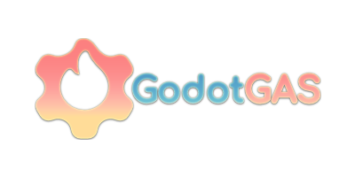

  

[☕ Buy me a Coffee!](https://ko-fi.com/yulrundev)

# GodotGAS
**A Production-Ready Gameplay Ability System for Godot 4.6+**

GodotGAS is a robust, data-driven framework written entirely in GDScript, heavily inspired by Unreal Engine's renowned Gameplay Ability System (GAS). It provides a highly scalable architecture for managing complex interactions between abilities, attributes, tags, and status effects in your Godot projects.

Whether you are building an RPG, a MOBA, or a fast-paced action game, GodotGAS decouples your logic so you can focus on designing unique gameplay rather than untangling spaghetti code.

---

## Full Documentation
This README provides a high-level overview. For the complete setup guide, deep dives into the architecture, and API references, please visit the official documentation:

**[GodotGAS Official Documentation](https://www.yulrun.dev/GodotGAS/)**

---

## Core Features

* **The Ability System Component (ASC):** The central state manager and event bus for your entities. It routes payloads, manages active effect lifecycles (with safe `cleanup()` teardowns), and broadcasts isolated signals (`attribute_changed`, `effect_received`) to keep your UI completely decoupled from combat math.
* **Strict Gameplay Tags:** Hierarchical state tracking (e.g., `Status.Stunned`, `Event.Damage.Critical`) utilizing optimized `StringName` comparisons. The framework auto-generates a static `GameplayTags` class for safe IDE autocomplete and features strict Regex validation to keep your tags pristine.
* **Execution Calculations (ExecCalcs):** Move beyond simple modifiers. Write custom mathematical formulas that read live stats from both the Attacker and the Defender simultaneously (e.g., `Damage = Attacker.AttackPower - Defender.Armor`).
* **Object-Pooled Gameplay Cues:** A highly efficient, Variant-based Object Pool managed by the global `GameplayCueManager`. Fire off visual effects, audio, and floating combat text safely without instantiation micro-stutters or memory leaks.
* **Decoupled Payload Pipeline:** A structured data flow routing `TargetData` -> `GameplayEffectContext` -> `GameplayEffectSpec` to guarantee accurate calculations and instigator/causer tracking across the network.
* **Data-Driven Effect Stacking:** An elegant, built-in solution for stacking policies. Developers can easily manage stacking by utilizing arrays like `application_ignore_tags` directly within standard `GameplayEffect` resources.
* **Editor Dashboard (`@tool`):** A polished, custom Godot Editor UI for performing CRUD operations on Tags and Cues, alongside an **Attribute Set Generator** that instantly drafts and writes C++ macro-style GDScript files for your stats.
* **Event-Driven Abilities:** Completely decoupled hardware input routing (`Input IDs`) and event-listening built natively into `GameplayAbility`, allowing for charge-ups, channeling, and passive reactive triggers.

## Quick Start / Installation

1. Download the latest release or clone this repository.
2. Copy the `addons/GodotGAS` folder into your Godot project's `addons/` directory.
3. Open your project in **Godot 4.6+**.
4. Navigate to `Project -> Project Settings -> Plugins` and enable **GodotGAS**.
5. The GodotGAS Editor Dashboard will appear in your editor's top tab menu, and the `GameplayCueManager` Autoload will be automatically registered.

*For your first "Hello World" setup, please refer to the [Quick Start Guide](https://www.yulrun.dev/GodotGAS/).*

## License

MIT License

Copyright (c) 2026 YulRun (https://www.yulrun.dev)

Permission is hereby granted, free of charge, to any person obtaining a copy
of this software and associated documentation files (the "Software"), to deal
in the Software without restriction, including without limitation the rights
to use, copy, modify, merge, publish, distribute, sublicense, and/or sell
copies of the Software, and to permit persons to whom the Software is
furnished to do so, subject to the following conditions:

The above copyright notice and this permission notice shall be included in all
copies or substantial portions of the Software.

THE SOFTWARE IS PROVIDED "AS IS", WITHOUT WARRANTY OF ANY KIND, EXPRESS OR
IMPLIED, INCLUDING BUT NOT LIMITED TO THE WARRANTIES OF MERCHANTABILITY,
FITNESS FOR A PARTICULAR PURPOSE AND NONINFRINGEMENT. IN NO EVENT SHALL THE
AUTHORS OR COPYRIGHT HOLDERS BE LIABLE FOR ANY CLAIM, DAMAGES OR OTHER
LIABILITY, WHETHER IN AN ACTION OF CONTRACT, TORT OR OTHERWISE, ARISING FROM,
OUT OF OR IN CONNECTION WITH THE SOFTWARE OR THE USE OR OTHER DEALINGS IN THE
SOFTWARE.
